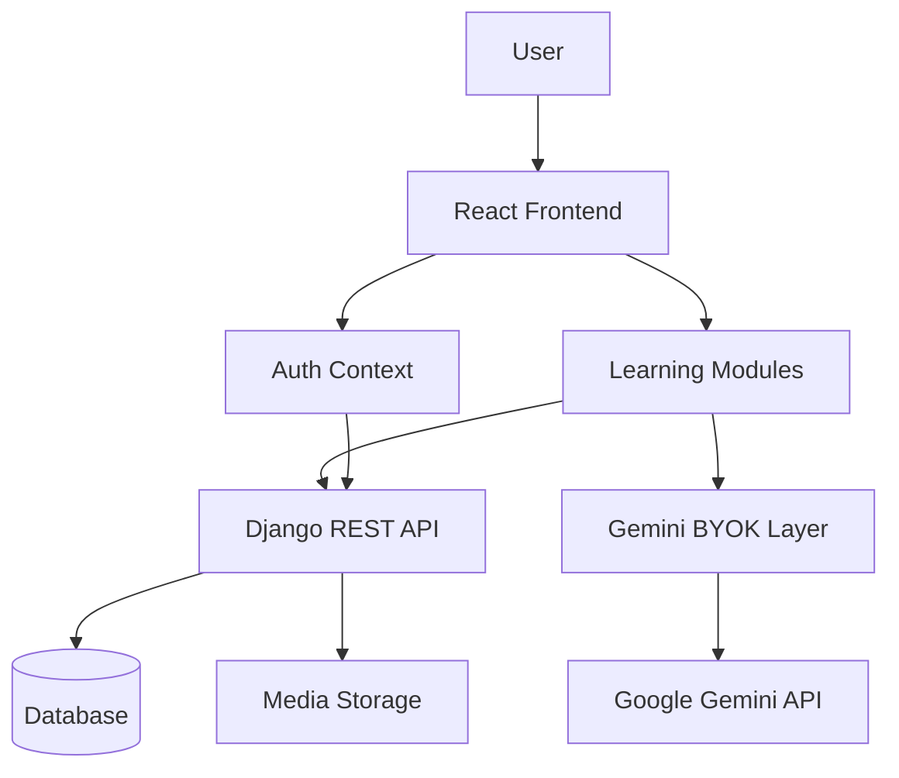

# ProLearn

<p align="center">
  
  
  
  
  
</p>

<p align="center">
  <b>A modern AI-powered learning platform built around personalized study, focused learning, and user-owned AI.</b>
</p>

---

## 📖 Table of Contents

* [Overview](#-overview)
* [Key Features](#-key-features)
* [Architecture](#-architecture)
* [Gemini BYOK](#-gemini-byok)
* [User-Facing Modules](#-user-facing-modules)
* [Getting Started](#-getting-started)
* [License](#-license)

---

## 🌐 Overview

**ProLearn** is an AI-powered learning platform designed to bring study planning, focused learning, educational resources, and AI assistance into one place.

Instead of treating AI as a hidden backend service, ProLearn uses a **Bring Your Own Key (BYOK)** approach with Google Gemini. Users can configure their own Gemini API key from their profile and use AI-powered features without ProLearn storing the key on the backend.

The result is a learning workspace where **AI planning, AI tutoring, resources, notes, and progress tracking work together**.

---

## ✨ Key Features

* 🤖 **Gemini-powered learning assistance**
* 🔑 **Frontend-only Gemini BYOK architecture**
* 🧠 **AI-generated interactive Study Plans**
* 🗺️ **React Flow-based visual study plans**
* ✅ **Interactive study-step completion tracking**
* 🏆 **Study Plan achievements**
* 🎓 **AI Tutor for personalized learning**
* 🤖 **AI Notes generated from Tutor conversations**
* 📚 **YouTube and Medium learning resources**
* 📝 **Custom User Notes**
* ⏱️ **Focus-time tracking and learning history**
* 👤 **User profiles with display name and avatar**
* 🪟 **Modern glassmorphism-based interface**
* 🔐 **Authenticated user-specific resources and study data**

---

## 🏗️ Architecture

ProLearn separates AI interaction from backend persistence. The Django backend handles application data and user state, while Gemini is accessed directly from the frontend.



### Core architectural principle

```text
Frontend
 ├── UI & application state
 ├── Gemini AI integration
 └── User-provided Gemini key
          │
          ▼
      Gemini API

Backend
 ├── Authentication
 ├── User profiles
 ├── Study Plans & steps
 ├── Resources & notes
 ├── Focus history
 └── Persistent application data
```

---

## 🔑 Gemini BYOK

ProLearn uses a **Bring Your Own Key** model for Gemini.

The Gemini integration lives entirely in the **frontend**.

### How it works

1. The user obtains a Gemini API key.
2. The key can be configured from the **Profile** page.
3. ProLearn's frontend uses the key to communicate with Gemini.
4. The backend does **not** receive or manage the Gemini API key.
5. The key is kept only for the current authenticated session.
6. When the user logs out, the stored Gemini key is released.

```text
Profile Page
     │
     │ Configure Gemini API Key
     ▼
Gemini Key Context
     │
     ▼
Frontend Gemini Service
     │
     ▼
Google Gemini API
```

This architecture keeps AI credentials out of the ProLearn backend and gives users direct control over their Gemini access.

> **Note:** Users are responsible for their own Gemini API usage and applicable Google AI/Gemini API limits or costs.

---

## 🧩 User-Facing Modules

### 📊 Dashboard

The central learning overview.

* Focus-time tracking
* Weekly learning goals
* Learning activity
* Completed Study Plan achievements
* Progress-oriented dashboard experience

---

### 🗺️ Study Plan

Turn a learning goal into an interactive roadmap.

Users provide a topic and description, after which Gemini generates a structured sequence of learning steps.

The generated plan is displayed as an interactive **React Flow** graph where individual steps can be marked complete.

```text
Learning Goal
      ↓
   Gemini
      ↓
Generated Steps
      ↓
Interactive Flow
      ↓
Complete Steps
      ↓
🏆 Achievement
```

---

### 📚 Resources

A unified space for collecting learning material.

Resources can include:

* 🎥 YouTube videos
* 📰 Medium articles
* 🤖 AI Notes
* 📝 User Notes

AI-generated responses can be saved from the AI Tutor, while users can also create their own notes directly inside Resources.

---

### 🤖 AI Tutor

A Gemini-powered learning companion for asking questions, exploring concepts, and getting contextual explanations.

AI Tutor responses can be saved as **AI Notes**, allowing useful explanations to become persistent learning resources.

---

## 🚀 Getting Started

### Prerequisites

Make sure you have:

* Python 3.10+
* Node.js 18+
* npm
* A database supported by the Django configuration
* A Gemini API key for AI-powered features

### 1. Clone the repository

```bash
git clone https://github.com/Mridul-23/ProLearn.git
cd ProLearn
```

### 2. Backend setup

```bash
cd backend

python -m venv .venv
```

Activate the virtual environment.

**Windows:**

```powershell
.venv\Scripts\activate
```

**Linux/macOS:**

```bash
source .venv/bin/activate
```

Install dependencies:

```bash
pip install -r requirements.txt
```

Apply migrations:

```bash
python manage.py migrate
```

Start the backend:

```bash
python manage.py runserver
```

### 3. Frontend setup

Open another terminal:

```bash
cd frontend
npm install
npm run dev
```

The Vite development server will provide the frontend URL.

### 4. Configure Gemini

After creating an account in ProLearn:

1. Open your **Profile** page.
2. Enter your Gemini API key.
3. Save the key.
4. Start using Gemini-powered features such as **AI Tutor** and **Study Plan**.

The key is session-lived and is cleared when you log out.

---

## 📄 License

ProLearn is released under the **MIT License**.

See the [`LICENSE`](LICENSE) file for the complete license text.

---

<p align="center">
  Built with React, Django REST Framework, and Google Gemini.
</p>
