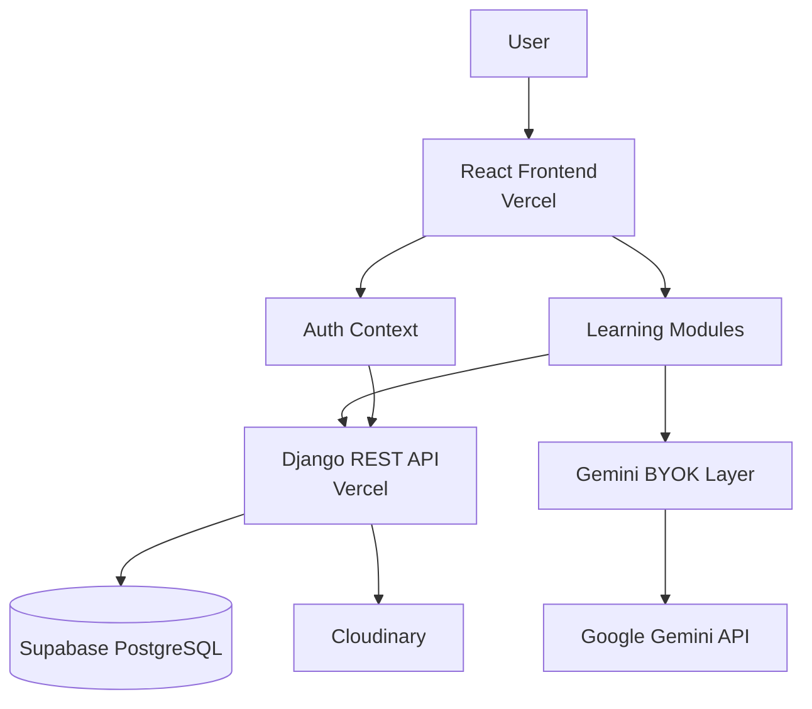

# ProLearn

<p align="center">
  
  
  
  
  <a href="https://prolearn-phi.vercel.app/">
    
  </a>
  
</p>

<p align="center">
  <b>A modern AI-powered learning platform built around personalized study, focused learning, transparency, and user-owned AI.</b>
</p>

---

## 📖 Table of Contents

* [Overview](#-overview)
* [Key Features](#-key-features)
* [Architecture](#-architecture)
* [Gemini BYOK](#-gemini-byok)
* [User-Facing Modules](#-user-facing-modules)
* [Security & Privacy](#-security--privacy)
* [Production Infrastructure](#-production-infrastructure)
* [Getting Started](#-getting-started)
* [License](#-license)

---

## 🌐 Overview

**ProLearn** is an AI-powered learning platform designed to bring study planning, focused learning, educational resources, AI assistance, and learning progress into one place.

Instead of treating AI as a hidden backend service, ProLearn uses a **Bring Your Own Key (BYOK)** approach with Google Gemini. Users can configure their own Gemini API key from their profile and use AI-powered features without ProLearn storing or managing the key on its backend.

ProLearn combines **AI-powered study planning, interactive learning, AI tutoring, resources, notes, focus tracking, and transparent AI activity auditing** into a unified learning workspace.

---

## ✨ Key Features

### 🤖 AI-Powered Learning

* 🔑 **Frontend-only Gemini BYOK architecture**
* 🧠 **AI-generated interactive Study Plans**
* 🗺️ **React Flow-based visual study plans**
* 🎓 **AI Tutor for personalized learning**
* 💡 **AI-powered Study Step exploration**
* 🤖 **AI Notes generated from Tutor conversations**
* 💾 **Persistent AI Tutor conversations**
* 🔄 **Explicit Refresh Chat mechanism**

### 📚 Learning & Productivity

* 📖 **YouTube and Medium learning resources**
* 📝 **Custom User Notes**
* 💡 **Saved Study Step explanations**
* ⏱️ **Global Focus Timer and focus-time tracking**
* 📊 **Learning history and dashboard activity**
* 🏆 **Study Plan achievements**
* ✅ **Separate study-step exploration and completion**

### 🔐 Security, Privacy & Transparency

* 👤 **Authenticated user-specific application data**
* 🛡️ **Account security controls**
* 🔍 **ProLearn Audit for recent Gemini activity**
* 📋 **Transparent Gemini request details**
* 📖 **Dedicated Gemini API key guidelines**
* 🔑 **Session-scoped Gemini key handling**
* 🚫 **Gemini API keys are never stored in audit records**

### 🎨 Interface

* 👤 **User profiles with display name and avatar**
* 🪟 **Modern glassmorphism-based interface**
* 📱 **Responsive learning workspace**

---

## 🏗️ Architecture

ProLearn separates AI interaction from backend persistence.

The **React frontend** handles the user interface, application state, and direct Gemini communication using the user's own API key.

The **Django REST backend** handles authentication and persistent application data, while production infrastructure provides managed database and media storage.



### Production Architecture

```text
                    ┌─────────────────────┐
                    │        User         │
                    └──────────┬──────────┘
                               │
                               ▼
                    ┌─────────────────────┐
                    │       Vercel        │
                    │                     │
                    │  React Frontend     │
                    │        +            │
                    │  Django REST API    │
                    └──────┬───────┬──────┘
                           │       │
                           │       │           ┌──────────────┐
                           │       ├──────────►|   Supabase   |
                           │       │           |  PostgreSQL  |
                           │       │           └──────────────┘
                           │       │
                           │       │           ┌──────────────┐
                           │       └──────────►|  Cloudinary  |
                           |                   |    media     |
                           |                   └──────────────┘
                           │
                           │ User's Gemini Key
                           ▼
                    Google Gemini API
```

### Core architectural principle

```text
Frontend
 ├── UI & application state
 ├── Authentication state
 ├── Gemini AI integration
 └── User-provided Gemini key
          │
          ├──────────────► Gemini API
          │
          ▼
      Django REST API
          │
          ├── Authentication
          ├── User profiles
          ├── Study Plans & steps
          ├── Resources & notes
          ├── Focus history
          └── AI activity audit data
                    │
                    ├────────► Supabase PostgreSQL
                    └────────► Cloudinary
```

---

## 🔑 Gemini BYOK

ProLearn uses a **Bring Your Own Key** model for Gemini.

The Gemini integration lives entirely in the **frontend**.

### How it works

1. The user obtains a Gemini API key.
2. The key can be configured from the **Profile** page.
3. ProLearn's frontend uses the key to communicate directly with Gemini.
4. The ProLearn backend does **not** receive or manage the Gemini API key.
5. The key is kept only for the current authenticated session.
6. When the user logs out, the stored Gemini key is released.

```text
Profile Page
     │
     │ Configure Gemini API Key
     ▼
Gemini Key Context
     │
     ▼
Frontend Gemini Service
     │
     ▼
Google Gemini API
```

This architecture keeps AI credentials out of the ProLearn backend and gives users direct control over their Gemini access.

> **Privacy Note:** ProLearn is designed so that your Gemini API key is handled on the frontend and is not stored by the ProLearn backend.

> **Usage Note:** Users are responsible for their own Gemini API usage and applicable Google AI/Gemini API limits or costs.

---

## 🧩 User-Facing Modules

### 📊 Dashboard

The central learning overview.

* Focus-time tracking
* Weekly learning goals
* Learning activity
* Completed Study Plan achievements
* Progress-oriented dashboard experience

---

### 🗺️ Study Plan

Turn a learning goal into an interactive roadmap.

Users provide a topic and description, after which Gemini generates a structured sequence of learning steps.

The generated plan is displayed as an interactive **React Flow** graph.

Study steps have two separate actions:

* 🔎 **Explore** a step to learn more about it with Gemini.
* ✅ **Complete** a step when the user has finished learning it.

When a step is explored, Gemini receives contextual information about the Study Plan and the selected step to generate an explanation tailored to the learning roadmap.

```text
Learning Goal
      ↓
   Gemini
      ↓
Generated Steps
      ↓
Interactive Flow
      ↓
  Explore Step --→ Gemini Explaination
      ↓
Complete Steps
      ↓
🏆 Achievement
```

---

### 📚 Resources

A unified space for collecting learning material.

Resources can include:

* 🎥 YouTube videos
* 📰 Medium articles
* 🤖 AI Notes
* 💡 Saved Study Step explanations
* 📝 User Notes

AI-generated responses can be saved from the **AI Tutor**, while users can also create their own notes directly inside Resources.

---

### 🤖 AI Tutor

A Gemini-powered learning companion for asking questions, exploring concepts, and getting contextual explanations.

Tutor conversations persist for the authenticated session, allowing users to navigate through ProLearn without unexpectedly losing their current conversation.

Users can also explicitly use **Refresh Chat** when they want to reset the current conversation.

Useful AI Tutor responses can be saved as **AI Notes**, turning explanations into persistent learning resources.

---

### ⏱️ Focus Timer

A global focus timer designed to support focused learning sessions.

* Start and manage focus sessions across the application.
* Track accumulated focus time.
* View learning activity through the dashboard.

---

### 🔍 ProLearn Audit

ProLearn provides visibility into recent Gemini requests initiated by the application.

The audit records the latest requests and provides details such as:

* Timestamp
* ProLearn component that initiated the request
* Purpose or action
* Exact prompt sent to Gemini
* Request status and relevant metadata

Users can open an audit entry to inspect its detailed request information.

> **Security:** Gemini API keys are never stored or exposed through audit records.

The audit exists to improve **transparency, accountability, and user awareness** when using a personal Gemini API key.

---

### 📖 Guidelines

The dedicated **Instructions / Guidelines** page explains how users can:

* Obtain a Gemini API key.
* Configure it in ProLearn.
* Rotate or revoke their key.
* Understand ProLearn's frontend-only BYOK architecture.
* Understand the privacy implications of using their own Gemini API key.

The page also provides step-by-step guidance and supporting screenshots.

---

### 👤 Profile & Account Security

The Profile page provides user account and personalization controls.

Users can manage:

* Display name
* Profile avatar
* Gemini API key configuration
* Account security controls

Profile media is stored using **Cloudinary** in the production environment.

---

## 🔐 Security & Privacy

Security and privacy are core principles of ProLearn's architecture.

### Gemini API Key

The Gemini API key:

* Is provided by the user.
* Is handled by the frontend.
* Is not sent to the ProLearn backend.
* Is not stored in ProLearn's database.
* Is released when the user logs out.
* Is never stored in ProLearn Audit records.

### User Data Isolation

Authenticated application data is associated with the corresponding user account.

ProLearn's authentication and application state are designed to prevent one user's application data from being exposed to another user.

### Transparency

The **ProLearn Audit** gives users visibility into recent Gemini requests initiated by the application.

This allows users to inspect what ProLearn sent to Gemini when using their own API key.

---

## ☁️ Production Infrastructure

The production deployment uses the following services:

| Component     | Technology          |
| ------------- | ------------------- |
| Frontend      | Vercel              |
| Backend       | Vercel              |
| Database      | Supabase PostgreSQL |
| Profile Media | Cloudinary          |
| AI            | Google Gemini API   |

```text
Vercel
 ├── React Frontend
 │      │
 │      └──────► Google Gemini API
 │               (user-owned API key)
 │
 └── Django REST API
          │
          ├──────► Supabase PostgreSQL
          │
          └──────► Cloudinary
```

This separation keeps application persistence and AI interaction logically independent while allowing ProLearn to use managed production infrastructure.

---

## 🚀 Getting Started

### Prerequisites

Make sure you have:

* Python 3.10+
* Node.js 18+
* npm
* A database supported by the Django configuration
* A Gemini API key for AI-powered features

### 1. Clone the repository

```bash
git clone https://github.com/Mridul-23/ProLearn.git
cd ProLearn
```

### 2. Backend setup

```bash
cd backend

python -m venv .venv
```

Activate the virtual environment.

**Windows:**

```powershell
.venv\Scripts\activate
```

**Linux/macOS:**

```bash
source .venv/bin/activate
```

Install dependencies:

```bash
pip install -r requirements.txt
```

Apply migrations:

```bash
python manage.py migrate
```

Start the backend:

```bash
python manage.py runserver
```

### 3. Frontend setup

Open another terminal:

```bash
cd frontend
npm install
npm run dev
```

The Vite development server will provide the frontend URL.

### 4. Configure Gemini

After creating an account in ProLearn:

1. Open your **Profile** page.
2. Enter your Gemini API key.
3. Save the key.
4. Start using Gemini-powered features such as **AI Tutor**, **Study Plans**, and **Study Step exploration**.

The key is session-lived and is cleared when you log out.

---

## 📄 License

ProLearn is released under the **MIT License**.

See the [`LICENSE`](LICENSE) file for the complete license text.

---

<p align="center">
  Built with React, Django REST Framework, and Google Gemini.
</p>
